# Tìm hiểu về DNS (Domain Name System)
### Mục lục

[I. Tổng quan về DNS](#tong-quan)

[II. Kiến trúc hoạt động của DNS](#kientruc-hoatdong)

  [1. Kiến trúc](#kien-truc)
    
  [2. Cách thức hoạt động](#hoat-dong)
    
  [3. Phân loai](#phan-loai)
    
  [4. Cơ chế hoạt động đồng bộ dữ liệu giữa các DNS Server](#co-che-hoat-dong)
    
  [5. Các bản ghi DNS ](#dns-record)
	
[III. LABs](#lab)
    [ Cấu hình Master-Slave DNS](#master-slave)
    
---

### <a name="tong-quan"></a>I. Tổng quan về DNS
 -  Hệ thống tên miền DNS (Domain Name System) được sử dụng để ánh xạ tên miền thành địa chỉ IP.
* Mục đích chính của DNS :
<ul>
<li>Phân giải địa tên máy thành địa chỉ IP và ngược lại.</li>
<li>Phân giải tên domain.</li>
</ul>


### <a name="kientruc-hoatdong"></a>II. Kiến trúc hoạt động của DNS

### <a name="kien-truc"></a>1. Kiến trúc DNS
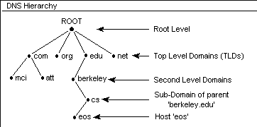


- Hệ thống tên miền được phân thành nhiêu cấp :
<ul>
<li>Root Domain: Là Server quản lý toàn bộ cấu trúc của hệ thống tên miền. Root Server không chứa dữ liệu thông tin về cấu trúc hệ thống DNS mà nó chỉ chuyển quyền (delegate) quản lý xuống cho các Server cấp thấp hơn. Nó có thể biểu diễn đơn giản chỉ là dấu chấm “.” 
</li>
<li>Top-level-domains (TLDs : Tên miền cấp một ) : Gồm 2 dạng 
	Tên miền theo tổ chức : .gov, .com, .net, .edu
	Tên miền theo địa lý :  .au , .vn , .eu.	
</li>
<li> Second-level-domain (Tên miền cấp hai): Đây là phần chính của tên miền. Nó có thể thay đổi theo người mua. VD : vccloud.com
</li>
<li>Sub-Domain): Chia thêm ra của tên miền cấp hai trở xuống thường được sử dụng như chi nhánh, phòng ban của một cơ quan hay chủ đề nào đó.  VD : sales.vccloud.com
</li>
</ul>

<image >

---
##### <a name="hoat-dong"></a>2. Các thức hoạt động
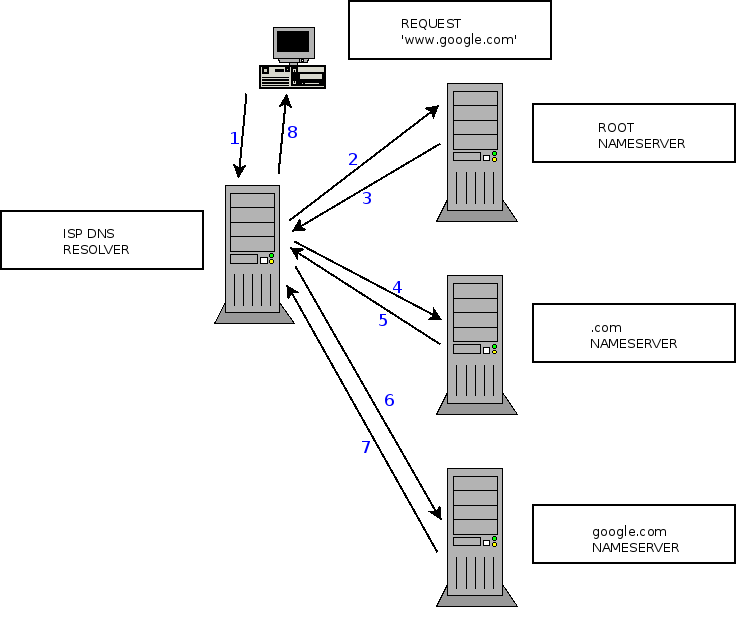
<ul>
<li>(1)  Người dùng gửi yêu cầu đến ISP DNS reslover để hỏi về địa chỉ IP ứng với tên miền " www.google.com" 
</li>
<li>(2) DNS reslover sẽ hỏi Root Domain xem ở đâu có thể tìm địa chỉ của tên miền "www.google.com".
</li>
<li>(3)  Máy chủ Root DNS không biết địa chỉ này là gì nhưng biết máy chủ DNS chịu trách nhiệm quản lý tên miền .com (TLDs). Hãy hỏi tiếp máy chủ DNS đó.
</li>
<li>(4) DNS reslovers hỏi máy chủ TLDs về địa chỉ "www.google.com".
</li>
<li>(5) Máy chủ TLDs không biết địa chỉ này nhưng biết máy chủ DNS chịu trách nhiệm cho tên miền .google.com là Second Level Domain. Hãy hỏi tiếp máy chủ DNS đó  
</li>
<li>(6) DNS Reslover tiếp tục hỏi máy chủ Second Level Domain .
</li>
<li>(7) Máy chỉ Second Level Domain trả về địa chỉ IP gắn với tên miền "www.google.com" cho ISP DNS reslover.
</li>
<li>(8) ISP DNS reslover gửi thông tin nhận được cho người dùng. Sau đó người dùng biết địa chỉ IP để truy cập đến "www.google.com".
<li.
</il>
---

##### <a name="phan-loai"></a>3. Phân loại DNS
- Có 3 loại DNS server :
<ul>
<li>Primary DNS server </li>
<li>Secondary DNS server</li>
<li>Caching DNS server</li>
</ul>

**Primary DNS server**

 - Thông tin về tên miền do nó quản lý được lưu trữ tại đây và sau đó có thể được chuyển sang cho các Secondary Server.
 - Các tên miền do Primary Server quản lý thì được tạo và sửa đổi tai Primary Server và được cập nhật đến các Secondary Server.

**Secondary DNS server**

 - DNS khuyến nghị nên sử dụng ít nhất là hai DNS Server để lưu cho mỗi một Zone. Primary DNS Server quản lý các Zone và Secondary Server sử dụng để lưu trữ dự phòng cho Primary Server.
 - Secondary Server được phép quản lý domain nhưng dữ liệu về tên miền (domain), nhưng Secondary Server không tạo ra các bản ghi về tên miền (domain) mà nó lấy về từ Primary Server.
 - Khi lượng truy vấn Zone tăng cao tại Primary Server thì nó sẽ chuyển bớt tải sang cho Secondary Server .Hoặc khi Primary Server gặp sự cố không hoạt động được thì Secondary Server sẽ hoạt động thay thế cho đến khi Primary Server hoạt động trở lại.
  -  Primary Server thường xuyên thay đổi hoặc thêm vào các Zone mới. Nên DNS Server sử dụng cơ chế cho phép Secondary lấy thông tin từ Primary Server và lưu trữ nó. Có hai giải pháp lấy thông tin về các Zone mới là lấy toàn bộ (full) hoặc chỉ lấy phần thay đổi (incremental).

**Caching-only Server**

 - Tất cả các DNS Server đều có khả năng lưu trữ dữ liệu trên bộ nhớ cache của máy để trả lời truy vấn một cách nhanh chóng. Nhưng hê thống DNS còn có một loại Caching-only Server.
 - Loại này chỉ sử dụng cho việc truy vấn, lưu giữ câu trả lời dựa trên thông tin có trên cache của máy và cho kết quả truy vấn. Chúng không hề quản lý một domain nào và thông tin mà nó chỉ giới hạn những gì được lưu trên cache của Server.
 
 ---
 
######  Đồng bộ dữ liệu giữa các DNS Server (Zone transfer) 
- Có 2 cách đồng độ dữ liệu :
<ul>
<li>Đồng bộ toàn phần(all zone transfer)</li>
<li>Đồng bộ phần thay đổi (incremental zone transfer)</li>
</ul>
---

###### Các DNS Zone :

<ul>
<li>Forward Lookup Zone : Dùng để phân giải host name thành địa chỉ IP.</li>
<li>Reverse Lookup Zone : Dùng để phân giải ngược giống như In-addr.arpa Zone. Cho phép phân giải địa chỉ IP thành host name.</li>
</ul>
---

#####Resource Records :

– Là hệ thống cơ sở dữ liệu của DNS, được sử dụng để trả lời cho các truy vấn từ DNS Client.

##### Recursion Query và Iteration Query 
-  Khi DNS Server không phân giải được host name, nó sẽ chuyển đến một DNS Server khác (forwarded) trong mạng. Quá trình này được gọi là kiểu yêu cầu Recursive ( phân giải đệ quy).
- Nếu Recursion bị disable thì nó sẽ sử dụng Iterative (tương tác), tức là nó sẽ gởi yêu cầu phân giải lại tên của host name. Khi có một truy vấn từ Client, trước hết nó sẽ tìm trong cơ sở dữ liệu của chính nó, nếu không có, nó sẽ cho biết một máy chủ khác mà từ đó có thể tìm thấy kết quả truy vấn.
- Nói cách khác, Recursion chỉ query trong local, còn Iterative có thể query ra ngoài internet.

---

##### <a name="co-che-dong-bo"></a> 4. Cơ chế hoạt động đồng bộ dữ liệu giữa các DNS Server
- 
Với trao đổi IXFR Zone ( Incremental Zone Transfer) thì sự khác nhau giữa số serial number của nguồn dữ liệu và bản sao của nó. Nếu cả hai đều có cùng số serial thì việc truyền dữ liệu của Zone sẽ không được thực hiên.
- Nếu số serial cho dữ liệu nguồn lớn hơn số serial của Secondary Server thì nó sẽ thực hiện gửi những thay đổi của bản ghi nguồn (Resource record – RR) của Zone ở Primary Server.
**- Các bước yêu cầu chuyển dữ liệu từ Secondary Server đến DNS Server chứa Zone để yêu cầu lấy dữ liệu về Zone mà nó quản lý :
**
<ul>
<li>Khi cấu hình DNS Server mới, thì nó sẽ gửi truy vấn yêu cầu gửi toàn bộ Zone ( all Zone transfer request (AXFR) ) đến DNS Server chính quản lý dữ liệu của Zone.</li>
<li>DNS Server chính quản lý dữ liệu của Zone trả lời và chuyển toàn bộ dữ liệu về Zone cho Secondary Server mới cấu hình.</li>
<li>Để xác định có chuyển dữ liệu hay không thì nó dựa vào số serial được khai báo bằng bản ghi SOA.</li>
<li>Khi thời gian làm mới (refresh interval ) của Zone đã hết, thì DNS Server nhận dữ liệu sẽ truy vấn yêu cầu làm mới Zone tới DNS Server chính chứa dữ liêu Zone.</li>
<li>DNS Server chính quản lý dữ liệu sẽ trả lời truy vấn và gửi lại dữ liệu. Trả lời truy vấn dữ liệu gồm số serial của Zone tại DNS Server chính.</li>
<li>DNS Server nhận dữ liệu về Zone và sẽ kiểm tra số serial trong trả lời và quyết định xem có cần truyền dữ liêu không :
<ul>
<li>Nếu giá trị của số serial của Primary Server bằng với số serial lưu tại nó thì sẽ kết thúc luôn. Và nó sẽ thiết lập lại với các thông số cũ lưu trong máy.</li>
<li>Nếu giá trị của số serial tại Primary Server lớn hơn giá trị serial hiện tại DNS nhận dữ liệu. Thì nó kết luận Zone cần được cập nhật và cần đồng bộ dữ liệu giữa hai DNS Server</li>
</ul>
</li>
<li>Nếu DNS Server nhận kết luận rằng Zone cần phải lấy dữ liệu thì nó sẽ gửi yêu cầu IXFR tới DNS Server chính để yêu cầu truyền dữ liệu của Zone.</li>
<li>DNS Server chính sẽ trả lời với việc gửi những thay đổi của Zone hoặc toàn bộ Zone :</li>
<ul>
<li>Nếu DNS Server chính có hỗ trợ việc gửi những thay đổi của Zone thì nó sẽ gửi những phần thay đổi của nó (Incremental Zone transfer of the Zone).</li>
<li>Nếu DNS Server chính không hỗ trợ thì nó sẽ gửi toàn bộ Zone (Full AXFR transfer of the Zone).</li>
</l>
</ul>
---

##### <a name="dns-record"></a> 5. Các bản ghi DNS

###### Bản ghi SOA (Start of Authority)

- Trong mỗi tập tin CSDL phải có và chỉ có 1 bản ghi SOA chỉ ra máy chủ nameserver là nơi cung cấp thông tin tin cây từ dữ liệu có trong zone : 
     
  ```[domain name] IN SOA [dns-server][email-address]
(
   [serial number]; 
   [refresh number]; 
   [retry number]; 
   [expire number];
   [time-to-live number];
) ```

- Serial number : là giá trị để xem dữ liệu có được đồng bộ hay không. Nếu giá trị trên Primary DNS lớn hơn Secondary DNS thì quá trình chuyển dữ liệu mới được bắt đầu.
- Refresh interval : thời gian cập nhật các record.
- Retry interval : trong trường hợp Secondary DNS không thể kết nối với Primary DNS, thì Secondary DNS sẽ thực hiện kết nối lại sau khoảng thời gian Retry interval.
-  Experis after : đây là khoảng thời gian mà Secondary DNS không thể kết nối với Primary DNS, dữ liệu trên Secondary DNS sẽ bị hủy.
- Minimum (default) TTL : đây là giá trị áp dụng cho tất cả các bản ghi trong file dữ liệu, tham số này xác định dữ liệu sẽ được cache tại Primary DNS trong bao lâu.
- TTL ( time to live) :  Đây là khoảng thời gian Primary DNS đươc caching dữ liệu. Khi hết khoảng thời gian này, dữ liệu được caching sẽ bị xóa. 

---

###### Bản ghi A(Address) và CNAME (Canonical Name)

***Bản ghi A*** : ánh xạ tên vào địa chỉ IP 

- Cú pháp :
`[Domain] IN A [địa chỉ ip máy]`

***Bản ghi CNAME***

- Bản ghi CNAME: Tạo alias trỏ vào tên ở bản ghi A. Cho phép 1 máy tính có thể có nhiều tên, nói cách khác thì bản ghi này cho phép nhiều tên cùng trỏ vào 1 địa chỉ Ip cho trước. Để khai báo bản ghi CNAME thì bắt buộc phải có bản ghi A để khai bảo tên máy. Tên miền ở bản ghi A trỏ đến địa chỉ ip của máy được gọi là tên miên chính (canoncial domain). Các tên miền khác muốn trỏ đến máy tính này phải được khai báo là bí danh của tên máy (alias domain).

* Cú pháp :

` [alias-domain] IN CNAME [canonical domain]`

###### Bản ghi NS: Bản ghi dùng để khai báo máy chủ tên miền cho 1 tên miền.

- Cú pháp :

` [domain name] IN NS [DNS Server]`

- domain name : Tên miền
- DNS Server : Tên máy chủ tên miền

######  Bản ghi PTR : Là bản ghi dùng để ánh xạ địa chỉ IP thành tên máy.

- Cú pháp :
`[IP] IN PTR [host-name]`

---

### <a name="labs"></a> III. Labs

***Chuẩn bị***

|                        | Primary DNS server | Secondary DNS  | DNS Client  |
|---------------- : | ------------- |:-------------:| -----:|
| HostName  | Ubuntu Server 16.04  | Ubuntu Server 16.04 | Ubuntu Server 16.04 | 
| HostName  | pri.vinhkma.com | sec.vinhkma.com|client.vinhkma.com| 
| IP Address    | 10.0.0.128 | 10.0.0.129 |  10.0.0.130 | 

---

##### <a name="master-slave"></a> Cấu hình Master-Slave DNS

***1. Cài đặt và cấu hình trên Primary DNS server or Master DNS server***

- Install Bind on the DNS Server
``` 
sudo apt-get update
sudo apt-get install bind9 bind9utils bind9-doc
```
- Configuring Caching name server
   Caching name server lưu lưu trữ kết quả truy vấn DNS cục bộ trong một khoảng thời gian cụ thể. Nó làm giảm lưu lượng truy cập của máy chủ DNS bằng cách lưu các truy vấn cục bộ, do đó nó cải thiện hiệu suất và hiệu quả của máy chủ DNS.
  
- Chỉnh sửu file /etc/bind/named.conf.options :

`sudo nano /etc/bind/named.conf.options`

- Bỏ comment và thêm địa chỉ ISP của bạn hoặc thêm địa chỉ Google public DNS server IP .

```
forwarders {
 8.8.8.8;
 };
```
- Sau đó restart lại bind9

`sudo systemctl restart bind9`

- Tất cả cấu hình DNS sẽ được lưu tại thư mục /etc/bind
- Đầu tiên ta sẽ cấu hình forward and reverse zone files.
- Chỉnh sửa file /etc/bind/named.conf.local với nội dung :
 


 Ở đây, for.vinhkma.com là tệp foward zone file và rev.vinhkma.com là reverse zone file, 10.0.0129 là địa chỉ IP của Secondary DNS server. Sử dụng Secondary DNS server vì 2NS  sẽ bắt đầu tìm nạp các truy vấn nếu Primary DNS server bị lỗi.
 
- Tiếp theo ta sẽ tạo zone file mà chúng ta đã định nghĩa trong tệp /etc/bind/named.conf.local 
 
 *Đầu tiên ta sẽ tạo forward zone file :* 
 
 `sudo nano /etc/bind/for.vinhkma.com`
 
- Cấu hình bản ghi SOA như sau : 
 


 *Tiếp theo ta sẽ tạo reverse zone file :*
 
 `sudo nano /etc/bind/rev.vinhkma.com`
 
 - Thêm các dòng sau : 

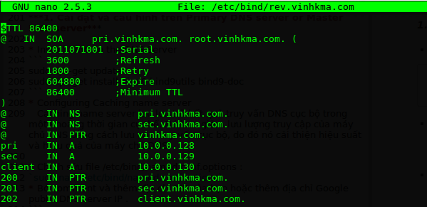
 
 - Phân quyền cho thư mục bind9
 
 `sudo chmod -R 755 /etc/bind`
 `sudo chown -R bind:bind /etc/bind`
 
 - Verify cấu hình DNS v zone files. 
 
 `sudo named-checkconf /etc/bind/named.conf
 `
 `sudo named-checkconf /etc/bind/named.conf.local
 `
 - Tiếp tục kiểm tra zone file sử dụng lệnh sau :
 `sudo named-checkzone vinhkma.com /etc/bind/for.vinhkma.com`


  `sudo named-checkzone vinhkma.com /etc/bind/rev.vinhkma.com`
  
  
 
  
  - Chỉnh sửa file cấu hình network và thêm địa chỉ IP cuar Private DNS server.

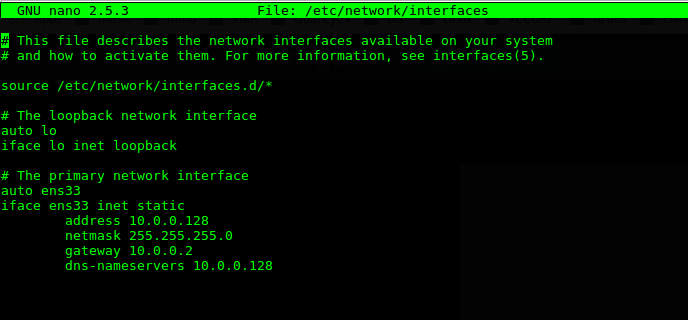
 
 - Cuối cùng restart Bind9 service
 `sudo systemctl restart bind9`
 
- Testing primary DNS server
 
 `dig pri.vinhkma.com`
 
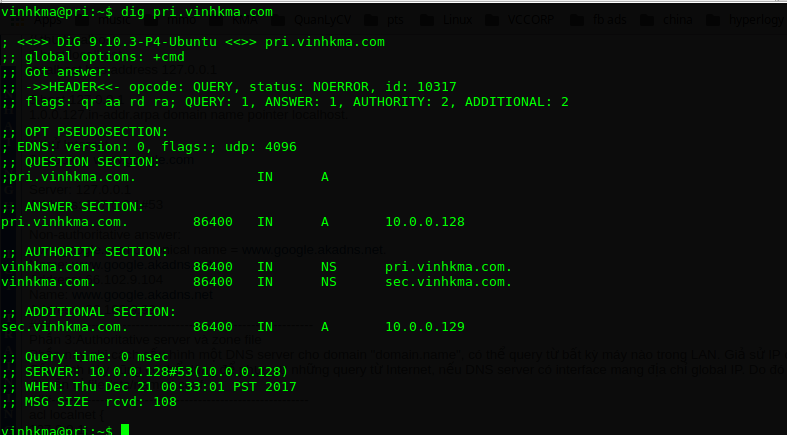


***2. Cài đặt và cấu hình trên Second DNS server or Slave DNS server***

- Install Bind on the DNS Server
``` 
sudo apt-get update
sudo apt-get install bind9 bind9utils bind9-doc
```
- Tạo zone file trong file cấu hình /etc/bind/named.conf.local như sau :
 
 
 
- Chú ý:  path của zone files phải nằm trong thư mục  /var/cache/bind *
- Tiếp theo, sẽ phân quyền cho thư mục bind 
 
 `sudo chmod -R 755 /etc/bind`
 `sudo chown -R bind:bind /etc/bind`
 
- Chỉnh sửa file cấu hình network và thêm địa chỉ của Primary và secondary DNS server.
 
 `sudo nano /etc/network/interfaces`

 

- Testing primary DNS server:
 
 `dig sec.vinhkma.com`

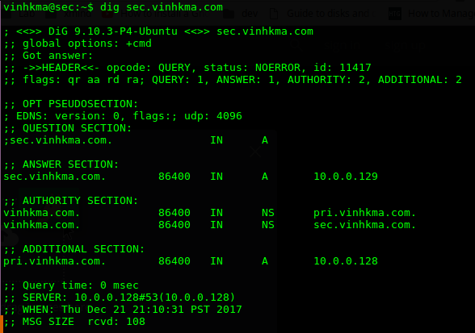

`Chú ý: zone files chỉ được chuyển khi số  Serial Number trên Primary DNS server lớn hơn Second DNS server.`
 
***3.Cấu hình trên DNS Client***

- Chỉnh sửa file cấu hình Network và thêm địa chỉ IP nameserver của Primary DNS và Second DNS Server.

`sudo nano /etc/network/interfaces`

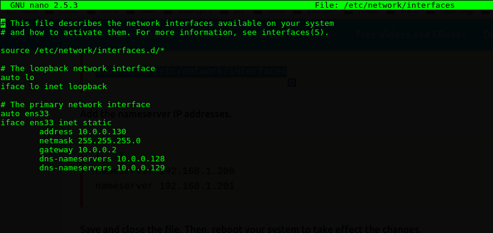

- Cuối cùng ta sẽ sử dụng dig command để kiểm tra :

 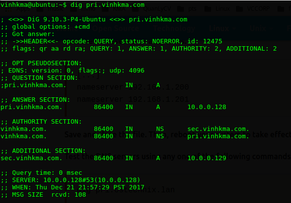
 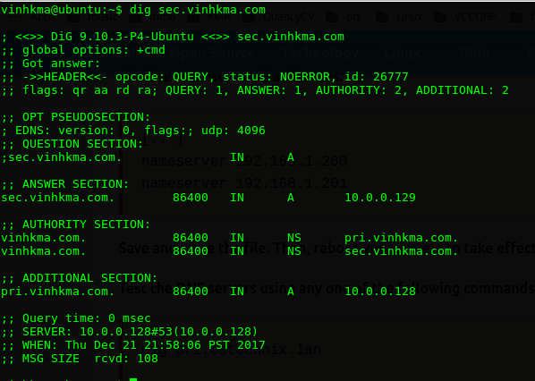
 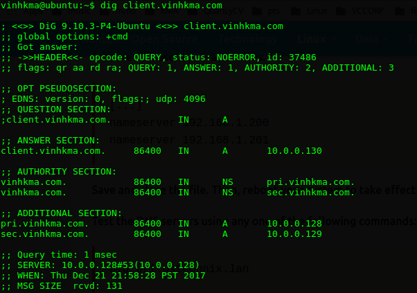
 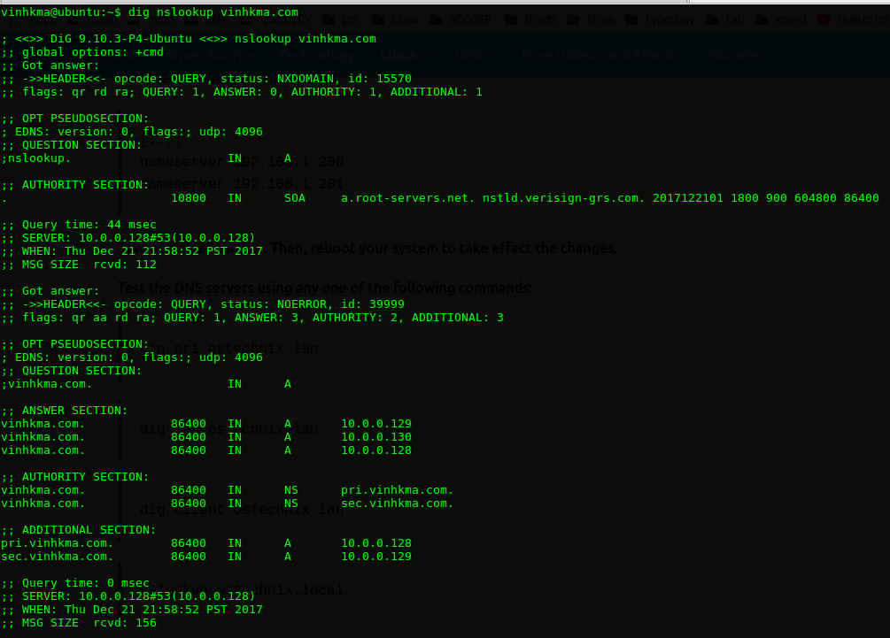


