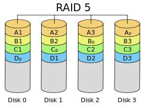

# Tìm hiểu về các loại RAID lưu trữ

### 1. Khái niệm
 - Raid là hình thức ghép nhiều ổ cứng vật lí thành một hệ thống ổ  đĩa cứng có chức năng tăng tốc đô đọc /ghi dữ liệu hoặc tăng tính an toàn của dữ liệu . (Có thể kết hợp cả 2 yếu tố trên )
___

### 2. Ưu nhược điểm của từng loại Raid
  - Có nhiều loại Raid nhưng mình sẽ tìm hiểu một số loại raid phổ biến là : Raid 0 ,Raid 1 ,raid 5 và raid 10 .
 ___

#### Raid 0
  `Đặc điểm `
  * Để  có thể setup raid 0 thì server cần có ít nhất 2 ổ cứng
  *  Dung lượng sẽ được chia đều cho 2 ổ cứng => giúp giảm thời gian đọc ghi giữ liệu

 `Ưu điểm `
      - Tốc độ đọc ghi nhanh , gấp đôi bình thường

  `Nhược điểm`
      - Rủi ro về mất dữ liệu . Nếu 1 trong 2 ổ bị hỏng thì khả năng mất dl rất cao .
      ___

### Raid 1

  `Đặc điểm `
  - Giống như raid 0 , server cần tối thiểu 2 ổ cứng .
  - Raid 1 an toàn hơn về dữ liệu do dữ liệu được ghi vào 2 ổ giống hệt nhau .

  `Ưu điểm`
    - An toàn về dữ liệu . 1 trong 2 ổ bị hỏng dữ liệu vẫn được đáp ứng .

  `Nhược điểm`
    - Hiệu suất không cao , chi phí đắt .
    - Do sử dụng 2 ổ cứng mà dung lượng lưu trữ chỉ bằng 1 ổ .

___

### Raid 10

`Đặc điểm `
  - Là sự kết hợp giữa raid 0 và raid 1 .
  - Để setup cần tối thiểu 4 ổ cứng .

 - Đối với Raid 10 dữ liệu được lưu đồng thời vào 4 ổ cứng. 2 ổ dạng striping (raid 0) và 2 ổ dạng (mirroring) raid 1 .

 `Ưu điểm`

    - Hiệu suất cao , an toàn cả khi 1 trong 4 ổ cứng bị hỏng dữ liệu vẫn ko bị mất .

 `Nhược điểm `
    - Dung lượng sử dụng chỉ bằng 1/2 dung lương của 4 ổ cứng giống raid 1.
    ___

### Raid 5

 

 `Đặc điểm `
   - Cần tối thiều 3 ổ cứng .
   - Giả sử có 1 file A khi lưu trữ tách 3 phần A1,A2,A3 . 3 phần này sẽ được lưu trên 3 ổ Disk 0 ,1,2 .còn ổ Disk 3 sẽ giữ bản sao lưu backup của 3 phần này => gần giống raid 0 và raid 1.

   `Ưu điểm`
    - Nâng cao hiệu suất , an toàn dữ liệu , tiết kiệm chi phí hơn so với raid 10 .
    - Hỏng 1 ổ HT chạy bt , 2 ổ hỏng hệ thống bị lỗi .
   `Nhược điểm`
    - Chi phí phát sinh thêm 1 ổ so vs hình thức lưu trữ thông thường.
    - TỔng dung lượng ổ cứng sau cùng bằng tổng dung lượng trừ đi 1 ổ. Ví dụ 4 ổ 500gb thì khi triển khai raid 5 chỉ còn 1500gb

___

### Raid 6
 - Giống chuẩn 5
 - Hỏng tối đa được 2 ổ .
